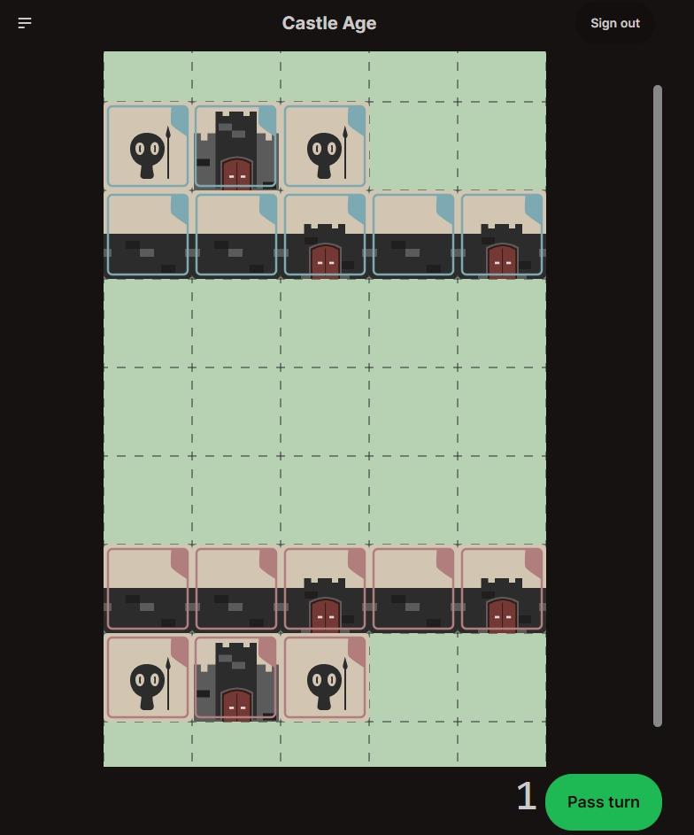

# Castle Age

Castle Age's frontend, in NextJS.

### What is that

Castle Age is a multiplayer turn-based game, made with NextJS + NestJS. Here, you challenge another player to a medieval battlefield commanding diverse units to take down his castle, while keeping yours safe.

